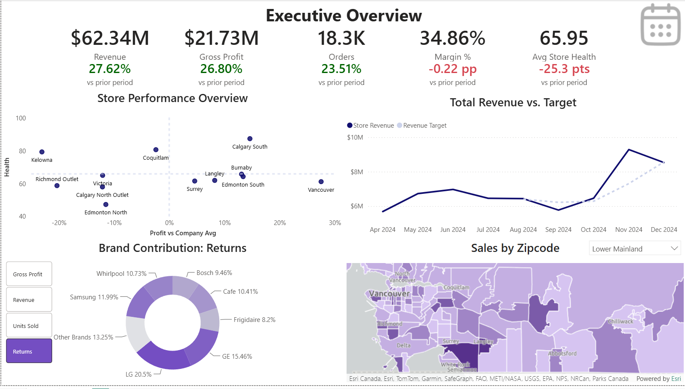
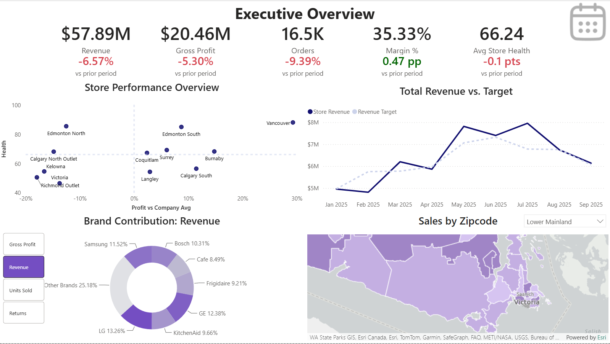
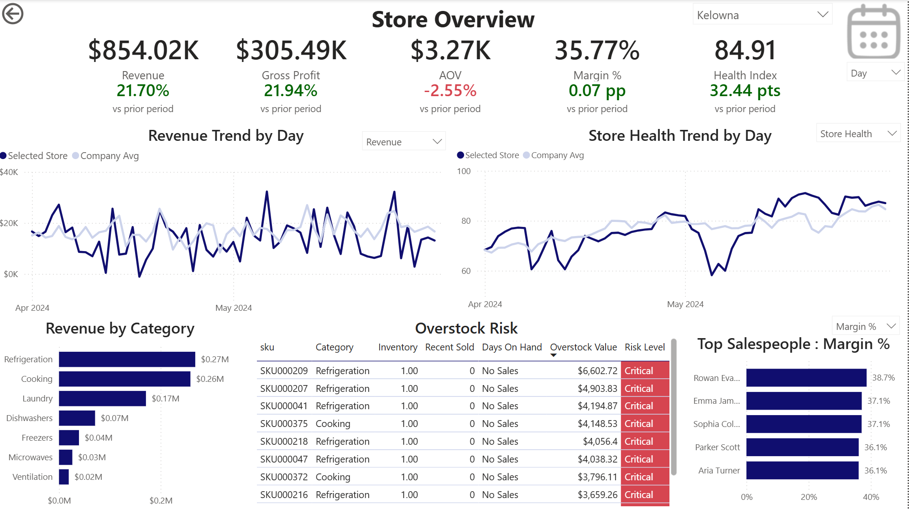
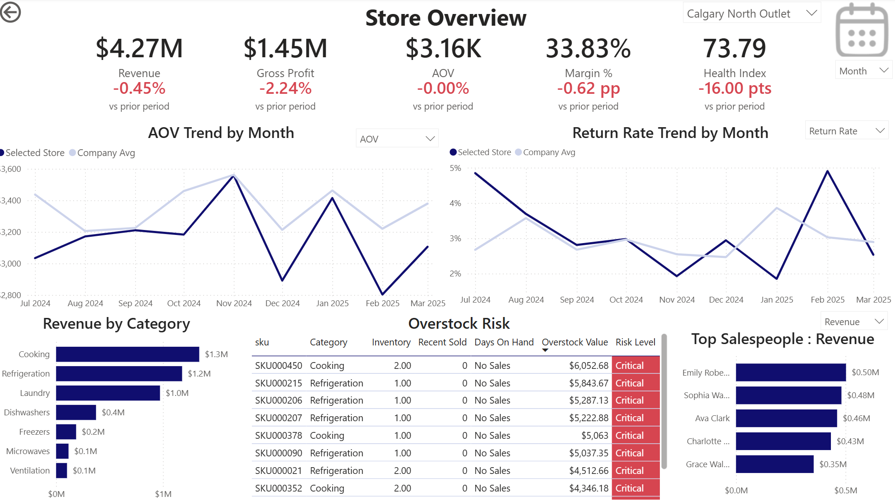

# Appliance Retail Analytics

An end-to-end retail analytics portfolio project built around a fictional multi-store Canadian appliance retailer. The project combines **Python**, **PostgreSQL**, **Azure**, **SQL**, **DAX**, and **Power BI** to move from synthetic operational data to business-facing reporting.

> **Note:** All data in this project is synthetic and was generated specifically for analysis and portfolio use. It does not represent a real retailer or real customers.

## Dashboard Preview

### Executive Overview



The Executive Overview is designed for company-level performance monitoring. It combines headline KPIs with store comparisons, target tracking, brand contribution, and customer geography.

Key elements include:

- **Revenue, Gross Profit, Orders, Margin %, and Average Store Health**
- Previous-period comparisons for all headline KPIs
- **Store Performance Overview** comparing store health with profitability relative to the company average
- **Total Revenue vs. Target** over time
- Dynamic **Brand Contribution** analysis with selectable Gross Profit, Revenue, Units Sold, and Returns
- **Sales by Postal Area** with a regional selector for focused geographic analysis
- Interactive date filtering across the page



### Store Overview



The Store Overview provides a more detailed operational view of an individual location.

It includes:

- Revenue
- Gross Profit
- Margin %
- Average Order Value
- Store Health
- Previous-period KPI comparisons
- Financial trend analysis
- Operational trend analysis
- Category performance
- Inventory / overstock risk
- Salesperson performance

Interactive selectors allow users to change the metric shown in several visuals without duplicating charts.



## Project Goal

The goal of this project is to demonstrate a complete analytics workflow rather than only a standalone dashboard.

The project covers:

- Relational data modeling
- Reproducible synthetic data generation
- Data quality validation
- Cloud PostgreSQL deployment
- Automated bulk data loading
- Reusable SQL analytics views
- Power BI data modeling
- DAX measures and time-intelligence calculations
- Executive and store-level dashboard design
- Business-oriented KPI analysis
- Git-based source control and documentation

## Architecture

```text
Python Synthetic Data Generator
            |
            v
     Generated CSV Data
            |
            v
Azure Database for PostgreSQL
     Flexible Server
            |
            v
Normalized Operational Tables
            |
            v
   PostgreSQL Analytics Layer
            |
            v
       Power BI Model
            |
            v
 Executive + Store Reporting
```

The operational database and reporting logic are intentionally separated.

**PostgreSQL / SQL** handles reusable joins, row-level business logic, and analytical views.  
**Power BI / DAX** handles filter-context-dependent measures, rolling calculations, previous-period comparisons, rankings, selectors, and interactive reporting logic.

## Technology Stack

| Area | Technology |
| --- | --- |
| Data generation | Python, NumPy |
| Database | PostgreSQL |
| Cloud hosting | Azure Database for PostgreSQL Flexible Server |
| Database connectivity | psycopg |
| Configuration | python-dotenv |
| SQL development | JetBrains DataGrip |
| Analytics | SQL, DAX |
| Visualization | Microsoft Power BI |
| Environment management | Miniconda |
| Version control | Git / GitHub |

## Synthetic Dataset

The project uses a reproducible synthetic operational dataset designed to behave more like a real retail business than a collection of independently randomized tables.

Default dataset:

- **Random seed:** `20260816`
- **History:** `2023-08-01` through `2026-07-31`
- **Stores:** 12
- **Employees:** 218
- **Customers:** 50,000
- **Products:** 1,000
- **Orders:** 71,464
- **Order items:** 120,096
- **Returns:** 3,143
- **Inventory transactions:** 396,118
- **Inventory snapshots:** 368,082

The generator includes correlated business behavior across stores, employees, products, inventory, promotions, and customers. Examples include store-specific traffic, seasonality, inventory-aware product selection, employee performance differences, returns linked to original order items, historical transaction prices and costs, promotion effects, and protection-plan attachment behavior.

This allows downstream analytics to surface meaningful differences between stores, products, employees, and time periods instead of producing completely random KPI movement.

## Operational Data Model

The PostgreSQL database contains **27 normalized operational tables** covering the main functions of the fictional retailer.

Major areas include:

- Stores and employees
- Customers
- Products, brands, and categories
- Orders and order items
- Payments
- Returns and return reasons
- Protection plans
- Promotions
- Warehouses and suppliers
- Purchase orders
- Inventory transactions and snapshots
- Date dimension

The operational model stores transaction-level facts. Metrics such as margin, growth, store health, rankings, and inventory performance are calculated downstream rather than being hardcoded into the generated dataset.

## Analytics Layer

Power BI does not reproduce the full normalized operational model directly.

Reusable reporting logic is moved into the PostgreSQL `analytics` layer. The repository includes analytical SQL for:

- Store daily performance
- Store category performance
- Store inventory performance / health
- Salesperson daily performance

These views provide cleaner reporting grains and centralize reusable transformations before the data reaches Power BI.

The general division of responsibility is:

### PostgreSQL / SQL

- Joining normalized operational tables
- Reusable business rules
- Daily and store-level analytical datasets
- Revenue and cost components
- Inventory and salesperson reporting inputs
- Reusable analytical views

### Power BI / DAX

- Filter-context-aware measures
- Previous-period comparisons
- Rolling calculations
- Store Health
- Company averages
- Rankings
- Dynamic metric selection
- Interactive trend analysis

## Key Analytics

### Store Health Index

A custom **Store Health Index** summarizes store performance across several operational and financial dimensions.

```DAX
Store Health Index =
    0.30 * [Profitability Score]
    + 0.25 * [Growth Score]
    + 0.20 * [Labour Efficiency Score]
    + 0.15 * [Return Performance Score]
    + 0.10 * [Protection Plan Score]
```

| Component | Weight |
| --- | ---: |
| Profitability Score | 30% |
| Growth Score | 25% |
| Labour Efficiency Score | 20% |
| Return Performance Score | 15% |
| Protection Plan Score | 10% |

A **30-day rolling Store Health** measure is used to reduce noise from isolated daily movements and make the underlying direction easier to interpret.

### Store Performance Overview

The Executive Overview compares each store across:

- **Health**
- **Profitability relative to the company average**

This creates a simple management view of stores that are both financially strong and operationally healthy, as well as locations that may require investigation.

### Revenue vs. Target

The executive dashboard compares actual revenue against a growth target over time, giving a quick view of whether current performance is above or below expectations.

### Brand Contribution

A dynamic brand visual can switch between:

- Gross Profit
- Revenue
- Units Sold
- Returns

The visual uses a Top-N-plus-Other structure so that the most important brands remain readable while still accounting for the full total.

### Customer Sales Geography

Customer sales are analyzed by Canadian postal area with a regional selector for:

- Lower Mainland
- Vancouver Island
- BC Interior
- Calgary & South Alberta
- Edmonton & Central Alberta

The current map uses **ArcGIS for Power BI** because Azure Maps is restricted by the Power BI tenant configuration used for this project. The geographic visual is therefore somewhat less polished than the other report components, but it still provides the intended regional sales analysis.

## Data Validation

The generated dataset includes automated validation before it is used for analytics.

Checks cover areas such as:

- Order and order-item reconciliation
- Payments and order status
- Inventory movements
- Return quantities and refunds
- Employee shift alignment
- Inventory snapshot consistency
- Identifier uniqueness

The generated `validation_report.txt` records the results of these checks.

## Data Loading

Generated data is loaded into PostgreSQL using a Python loader and PostgreSQL `COPY` rather than large numbers of individual `INSERT` statements.

The loader:

- Reads database configuration from environment variables
- Connects using `psycopg`
- Loads tables in dependency order
- Supports dry-run validation
- Reports progress
- Runs transactionally
- Rolls back on failure
- Supports clean reloads

Database credentials are stored locally in `.env` and are excluded from version control.

## Repository Structure

```text
appliance-analysis/
|
|-- .gitignore
|-- Dashboard Final.pbix
|-- README.md
|-- dataset_manifest.json
|-- environment.yml
|-- executive-overview-1.png
|-- executive-overview-2.png
|-- generate_appliance_retail_dataset.py
|-- store-overview-1.png
|-- store-overview-2.png
|-- validation_report.txt
|
`-- database/
    |-- create_tables.sql
    |-- load_data.py
    |-- load_data.sql
    |-- test_connection.py
    |
    `-- analytics/
        `-- reusable reporting view definitions
```

### Key Files

- [`Dashboard Final.pbix`](./Dashboard%20Final.pbix) — completed Power BI report containing the Executive Overview and Store Overview.
- `executive-overview-1.png` / `executive-overview-2.png` — Executive Overview screenshots.
- `store-overview-1.png` / `store-overview-2.png` — Store Overview screenshots.
- `generate_appliance_retail_dataset.py` — reproducible synthetic retail data generator.
- `dataset_manifest.json` — generated dataset metadata and row counts.
- `validation_report.txt` — dataset validation output.
- `database/create_tables.sql` — PostgreSQL operational schema.
- `database/load_data.py` — Python PostgreSQL bulk loader.
- `database/load_data.sql` — SQL-based loading support.
- `database/test_connection.py` — database connectivity test.
- `database/analytics/` — reusable analytical SQL used by the Power BI model.

Generated CSV files are intentionally excluded from Git because they are large and can be recreated from the fixed random seed.

## Running the Project

### 1. Create the Python environment

```bash
conda env create -f environment.yml
conda activate appliance-retail
```

### 2. Configure PostgreSQL credentials

Create a local `.env` file:

```env
POSTGRES_HOST=<your-server>.postgres.database.azure.com
POSTGRES_PORT=5432
POSTGRES_DB=appliance_retail
POSTGRES_USER=<your-username>
POSTGRES_PASSWORD=<your-password>
POSTGRES_SSLMODE=require
```

Do **not** commit `.env`.

### 3. Generate the synthetic dataset

```bash
python generate_appliance_retail_dataset.py --output appliance_retail_dataset
```

### 4. Create the PostgreSQL schema

```bash
psql -d appliance_retail -f database/create_tables.sql
```

### 5. Load the generated data

```bash
python database/load_data.py --dry-run
python database/load_data.py
```

### 6. Create the analytics layer

Run the SQL files in:

```text
database/analytics/
```

These views prepare reusable reporting datasets for Power BI.

### 7. Open Power BI

Open:

```text
Dashboard Final.pbix
```

Configure the PostgreSQL data source if necessary, then refresh the model.

## Security / Repository Notes

The repository contains source code, SQL definitions, validation output, documentation, screenshots, and the Power BI report.

It should **not** contain:

- `.env`
- Database passwords
- Azure credentials
- Generated raw CSV files
- Local virtual environments
- IDE cache files

## Why I Built This

This project was designed to practice the full analytics lifecycle: creating and validating source data, designing a relational model, loading it into a cloud database, building reusable SQL analytics, and turning those results into business-facing Power BI dashboards.

The focus was not only on producing visuals, but on connecting technical implementation to practical business questions:

- How is the company performing?
- Which stores are healthy and profitable?
- Which locations require attention?
- Is revenue meeting expectations?
- Which brands are driving results?
- Where are customers and sales concentrated?
- What is happening inside an individual store?
- Which categories, inventory positions, and salespeople are contributing to performance?

---

## Status

**Project complete.**

The final deliverable contains both the **Executive Overview** and **Store Overview** dashboards together with the underlying synthetic data generator, PostgreSQL operational model, analytics layer, validation process, and project documentation.
