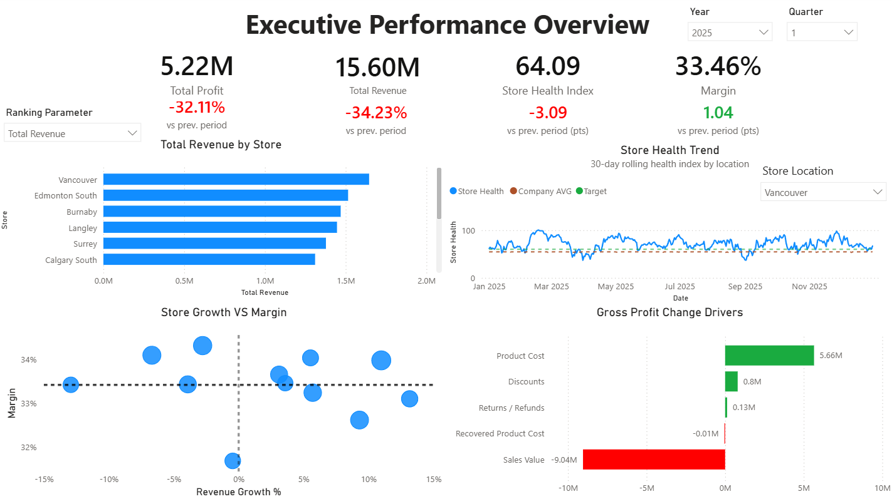

# Appliance Retail Analytics

An end-to-end retail analytics portfolio project built around a fictional multi-store Canadian appliance retailer. The project combines **Python**, **PostgreSQL**, **Azure**, **SQL**, and **Power BI** to move from synthetic operational data to executive-level business reporting.

> **Note:** All data in this project is synthetic and was generated specifically for analysis and portfolio use. It does not represent a real retailer or real customers.

## Executive Dashboard



**Current status:** Executive Overview complete; Store Detail page is the next planned report page.

The current Power BI Executive Performance Overview is designed to answer four questions:

1. **How is the company performing?**
2. **Which stores are performing best or worst?**
3. **How is store health changing over time?**
4. **What is driving changes in gross profit?**

### Current Executive Overview

The dashboard currently includes:

- **Total Profit** with previous-period comparison
- **Total Revenue** with previous-period comparison
- **Store Health** with previous-period comparison
- **Gross Margin** with previous-period comparison
- **Store Ranking** with selectable performance metrics
- **Store Health Trend** compared with the company average and target threshold
- **Store Growth vs. Margin** scatterplot for identifying high-growth, low-margin, and underperforming locations
- **Gross Profit Change Drivers** showing the contribution of sales value, product cost, discounts, returns/refunds, and recovered product cost relative to the previous quarter
- Year, quarter, and store-level filtering

## Project Goal

The goal of this project is to demonstrate a complete analytics workflow rather than only a standalone dashboard.

The project covers:

- Relational data modeling
- Reproducible synthetic data generation
- Data quality validation
- Cloud PostgreSQL deployment
- Automated bulk data loading
- SQL analytics and reusable reporting views
- DAX measures and time-intelligence calculations
- Executive dashboard design
- Business-oriented KPI and driver analysis
- Git-based source control and documentation

## Architecture

```text
Python Synthetic Data Generator
            |
            v
     Generated CSV Data
            |
            v
Azure Database for PostgreSQL
     Flexible Server
            |
            v
Normalized Operational Tables
            |
            v
   PostgreSQL Analytics Layer
            |
            v
       Power BI Model
            |
            v
Executive / Store Reporting
```

The operational database and analytical reporting logic are intentionally separated. PostgreSQL handles reusable transformations and row-level business logic, while Power BI/DAX handles calculations that depend on report filter context and interactive time periods.

## Technology Stack

| Area | Technology |
| --- | --- |
| Data generation | Python, NumPy |
| Database | PostgreSQL |
| Cloud hosting | Azure Database for PostgreSQL Flexible Server |
| Database connectivity | psycopg |
| Configuration | python-dotenv |
| SQL development | JetBrains DataGrip |
| Analytics | SQL, DAX |
| Visualization | Microsoft Power BI |
| Environment management | Miniconda |
| Version control | Git / GitHub |

## Synthetic Dataset

The project uses a reproducible synthetic operational dataset designed to behave more like a real retail business than a collection of independently randomized tables.

- **Random seed:** `20260816`
- **History:** `2023-08-01` through `2026-07-31`
- **Stores:** 12
- **Employees:** 218
- **Customers:** 50,000
- **Products:** 1,000
- **Orders:** 71,464
- **Order items:** 120,096
- **Returns:** 3,143
- **Inventory transactions:** 396,118
- **Inventory snapshots:** 368,082

### Realistic Business Behaviour

The generator includes correlated behaviour across stores, employees, products, inventory, promotions, and customers.

Examples include:

- Store-specific traffic and customer mix
- Weekday/weekend and seasonal demand patterns
- Employee productivity differences
- Employee discounting and premium-product tendencies
- Product/category seasonality
- Inventory-aware SKU selection
- Promotions and discretionary discounts
- Returns linked to original order items
- Historical transaction-time prices and product costs
- Sales linked to employee shift availability
- Purchase orders, receipts, transfers, and inventory movements
- Protection-plan attachment behaviour

This allows the downstream analytics to surface meaningful differences between stores, products, employees, and time periods instead of producing completely random KPI movement.

## Operational Data Model

The PostgreSQL database contains **27 normalized operational tables**.

### Stores and Employees

- `stores`
- `employee_roles`
- `employees`
- `employee_compensation_history`
- `employee_shifts`

### Customers and Products

- `customers`
- `brands`
- `categories`
- `products`
- `product_prices`

### Sales and Payments

- `orders`
- `order_items`
- `payments`

### Returns

- `return_reasons`
- `returns`
- `return_items`

### Protection Plans and Promotions

- `protection_plans`
- `order_protection_plans`
- `promotions`
- `order_item_promotions`

### Inventory and Purchasing

- `warehouses`
- `suppliers`
- `purchase_orders`
- `purchase_order_items`
- `inventory_transactions`
- `inventory_snapshots`

### Date Dimension

- `date_dimension`

The operational model stores transaction-level facts. Analytical metrics such as margin, growth, store health, rankings, and inventory performance are calculated downstream rather than being hardcoded into the generated dataset.

## Data Validation

The generated dataset includes automated validation checks before it is used for analytics.

Validated relationships include:

- Order subtotal, discounts, tax, and total reconciliation
- Order-item totals against order headers
- Payment totals against order status
- Sales transactions against inventory movements
- Returned quantities not exceeding sold quantities
- Refund totals against completed refund payments
- Employee sales occurring within recorded shifts
- Non-negative inventory snapshots
- Reserved inventory not exceeding inventory on hand
- Primary identifier uniqueness
- Final inventory snapshots reconciling to cumulative signed inventory transactions

The supplied validation report passed these checks for the generated dataset.

## Data Loading

The generated data is loaded into PostgreSQL using a Python loader and PostgreSQL `COPY` rather than thousands of individual `INSERT` statements.

The loader:

- Reads database configuration from environment variables
- Connects using `psycopg`
- Loads tables in dependency order
- Uses CSV headers to map columns explicitly
- Supports a dry-run mode
- Reports loading progress
- Runs transactionally
- Rolls back the load if a table fails
- Supports clean reloads

Example:

```bash
python database/load_data.py --dry-run
python database/load_data.py
```

Database credentials are stored locally in `.env` and are intentionally excluded from version control.

## Analytics Layer

Power BI does not need to reproduce all operational joins from scratch.

Reusable reporting logic is moved into PostgreSQL analytical views where appropriate. The current repository includes `database/analytics/store_daily_performance.sql`, which centralizes store/day reporting logic used by Power BI. This keeps row-level transformations centralized and makes the reporting model easier to understand.

The general split is:

### PostgreSQL / SQL

Used for:

- Joining normalized operational tables
- Reusable business rules
- Daily/store-level analytical datasets
- Revenue and cost components
- Store-level reporting inputs
- Reusable analytical views

### Power BI / DAX

Used for:

- Filter-context-aware measures
- Previous-period comparisons
- Rolling calculations
- Store health measures
- Rankings
- Dynamic metric selection
- Interactive driver analysis

## Key Analytics

### Store Health

The dashboard uses a custom **Store Health Index** to summarize store performance across several dimensions rather than relying on a single financial metric.

The index is calculated as:

```DAX
Store Health Index =
    0.30 * [Profitability Score]
    + 0.25 * [Growth Score]
    + 0.20 * [Labour Efficiency Score]
    + 0.15 * [Return Performance Score]
    + 0.10 * [Protection Plan Score]
```

The weighting gives the greatest importance to profitability and growth, while still incorporating labour efficiency, return performance, and protection-plan performance.

| Component | Weight |
| --- | ---: |
| Profitability Score | 30% |
| Growth Score | 25% |
| Labour Efficiency Score | 20% |
| Return Performance Score | 15% |
| Protection Plan Score | 10% |

For trend reporting, the dashboard uses a **30-day rolling Store Health measure** to reduce the effect of isolated unusually strong or weak days and make the underlying direction easier to interpret.

The executive view compares store health against:

- Historical performance
- The company-wide average
- A target / healthy threshold

This makes the metric useful both as a snapshot KPI and as a longer-term store performance indicator.

### Store Ranking

Stores can be compared using business measures such as:

- Revenue
- Gross profit
- Number of sales
- Average sale value
- Store health

This allows the executive view to move beyond a single fixed ranking.

### Growth vs. Margin

The store scatterplot compares revenue growth with margin to identify different performance profiles.

For example:

- High growth / high margin
- High growth / low margin
- Low growth / high margin
- Low growth / low margin

This helps distinguish stores that are growing profitably from stores where growth or profitability may require attention.

### Gross Profit Change Drivers

The driver visual explains **why gross profit changed relative to the previous quarter**.

The decomposition includes:

- Regular-price sales value
- Discounts
- Returns / refunds
- Product cost
- Recovered product cost

Cost-like components are shown based on their **impact on profit**, not simply their raw accounting sign. For example, lower product costs create a positive profit impact.

The individual driver contributions are reconciled to:

```text
Current Period Gross Profit - Previous Period Gross Profit
```

This provides a direct bridge between the headline profit KPI and the underlying operational movements.

## Planned Store Detail Page

The next planned Power BI page will allow a selected location to be analyzed in greater detail.

### KPIs

- Revenue
- Gross profit
- Margin
- Average order value

### Store Performance

- Store health trend
- Profit over time
- Profit breakdown by appliance/category

### Inventory

- Overstocked products / categories
- Inventory requiring attention

### Sales Team

- Top-performing salespeople for the selected store

The goal is to allow users to move from the company-wide executive view into the operational reasons behind a specific store's performance.

## Future Development

Potential later extensions include:

- Deeper salesperson performance analysis
- Inventory and purchasing dashboard
- Supplier performance
- Slow-moving and stockout analysis
- Store/category drill-through
- Additional report navigation and drill-through
- Automated report refresh
- Forecasting or anomaly detection

## Repository Structure

```text
appliance-retail/
|
|-- README.md
|-- environment.yml
|-- .gitignore
|-- Appliance-analysis-exe-overview.pbix
|-- exec-screenshot.png
|-- generate_appliance_retail_dataset.py
|-- dataset_manifest.json
|-- validation_report.txt
|
`-- database/
    |-- create_tables.sql
    |-- load_data.sql
    |-- load_data.py
    |-- test_connection.py
    `-- analytics/
        `-- store_daily_performance.sql
```

### Key Files

- `Appliance-analysis-exe-overview.pbix` — Power BI report containing the current Executive Performance Overview.
- `exec-screenshot.png` — screenshot of the current dashboard for quick viewing on GitHub.
- `generate_appliance_retail_dataset.py` — reproducible synthetic retail data generator.
- `dataset_manifest.json` — generated dataset metadata and row counts.
- `validation_report.txt` — output from the dataset validation process.
- `database/create_tables.sql` — PostgreSQL operational schema.
- `database/load_data.py` — Python PostgreSQL bulk loader.
- `database/load_data.sql` — SQL-based loading support.
- `database/test_connection.py` — database connectivity test.
- `database/analytics/store_daily_performance.sql` — analytical SQL view used as a major Power BI reporting source.

Generated CSV files are intentionally excluded from Git because they are large and can be recreated from the fixed random seed.

## Running the Project

### 1. Create the Python environment

```bash
conda env create -f environment.yml
conda activate appliance-retail
```

### 2. Configure PostgreSQL credentials

Create a local `.env` file:

```env
POSTGRES_HOST=<your-server>.postgres.database.azure.com
POSTGRES_PORT=5432
POSTGRES_DB=appliance_retail
POSTGRES_USER=<your-username>
POSTGRES_PASSWORD=<your-password>
POSTGRES_SSLMODE=require
```

Do **not** commit `.env`.

### 3. Generate the synthetic dataset

```bash
python generate_appliance_retail_dataset.py --output appliance_retail_dataset
```

### 4. Create the PostgreSQL schema

```bash
psql -d appliance_retail -f database/create_tables.sql
```

### 5. Load the generated data

```bash
python database/load_data.py --dry-run
python database/load_data.py
```

### 6. Create the analytics layer

Run the analytical view definition:

```bash
psql -d appliance_retail -f database/analytics/store_daily_performance.sql
```

The `store_daily_performance` view consolidates reusable store/day reporting logic for Power BI, while filter-context-dependent calculations remain in DAX.

### 7. Open Power BI

Open:

```text
Appliance-analysis-exe-overview.pbix
```

Configure the PostgreSQL data source if necessary, then refresh the model.

## Security / Repository Notes

The repository should contain source code, SQL definitions, validation output, documentation, and the Power BI report.

It should **not** contain:

- `.env`
- Database passwords
- Azure credentials
- Generated raw CSV files
- Local virtual environments
- IDE cache files

A suitable `.gitignore` should include:

```gitignore
.env
.env.*

data/raw/*.csv
data/raw/*.zip

__pycache__/
*.pyc

.venv/
venv/

.idea/
.vscode/

.DS_Store
Thumbs.db
```

## Why I Built This

This project was designed to practice the full analytics lifecycle: creating and validating realistic source data, designing a relational model, loading it into a cloud database, building reusable SQL analytics, and turning those results into business-facing Power BI dashboards.

The emphasis is on connecting technical implementation to practical questions such as:

- Which stores are performing well?
- Which stores are deteriorating?
- Is revenue growth profitable?
- What is driving changes in gross profit?
- Where should management investigate next?

---

**Status:** Executive Performance Overview complete. Store Detail page planned next.
